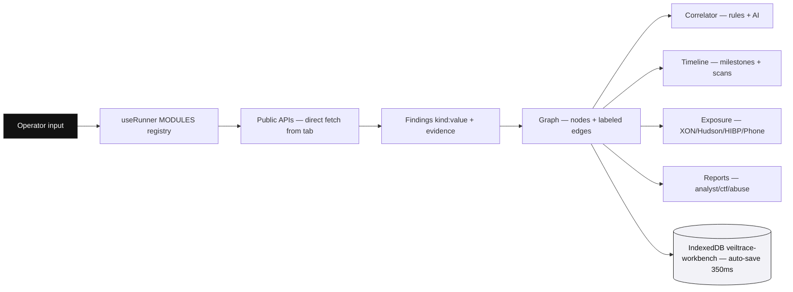

# VeilTrace Workbench — Product Requirements Document

**Version:** 1.3  
**Date:** 24 August 2026  
**Status:** Active — implements shipped v1.0 – v1.3, plans v1.4 and v2  
**Owner:** VeilTrace team  
**License:** MIT  
**Stack:** Vite + React 19 + @xyflow/react + Zustand + IndexedDB + Tailwind 4 + shadcn/ui — 100% browser-only, static `dist/` deploy  

---

## Table of Contents

1. [Overview](#1-overview)
2. [Problem](#2-problem)
3. [Goals & Non-Goals](#3-goals--non-goals)
4. [Users](#4-users)
5. [Architecture](#5-architecture)
6. [Privacy & Trust Model](#6-privacy--trust-model)
7. [Feature Specification](#7-feature-specification)
8. [Data Source Transparency](#8-data-source-transparency)
9. [UX Specification — Desktop & Mobile](#9-ux-specification--desktop--mobile)
10. [Performance, Offline & PWA](#10-performance-offline--pwa)
11. [Security — Keys & Vault](#11-security--keys--vault)
12. [Reporting](#12-reporting)
13. [Success Metrics](#13-success-metrics)
14. [Roadmap & Milestones](#14-roadmap--milestones)
15. [Delivery — How to Build](#15-delivery--how-to-build)
16. [Collaboration — How to Contribute](#16-collaboration--how-to-contribute)
17. [Risks & Mitigations](#17-risks--mitigations)
18. [Glossary](#18-glossary)
19. [Changelog](#19-changelog)

---

## 1. Overview

VeilTrace is a private, graph-first OSINT workbench that runs entirely in the browser. There is no backend, no account system, and no server log.

The operator enters a domain, email, username, phone, name, or image. The app queries public sources directly from the browser tab, renders every finding as a node on an infinite canvas, and provides deterministic correlation, optional AI assistance, verification trails, exposure checks, timeline, and one-click reports.

Core flow: **Discover → Correlate → Verify → Exposure → Pivot → Report**.

Tagline: **The investigation stays on the device. The evidence stays verifiable.**

---

## 2. Problem

- Manual recon scatters raw data across 10+ tools and tabs. Correlation and write-up take longer than collection.
- Hosted OSINT services log the investigator's own trace while the investigator follows a target's trace.
- Tables hide relationships. Analysts reason in graphs, not rows.
- Breach and exposure checks often require keys, proxies, or fake results in browser contexts.
- Mobile workflows are unsupported by existing graph tools.

VeilTrace solves these with a local graph, full evidence retention, key-free exposure where possible, and a mobile-native shell.

---

## 3. Goals & Non-Goals

### Goals (v1.x)

- Automate core recon: DNS, WHOIS/RDAP, Certificates, Wayback, Username, Email/Gravatar, Dork generation, Image EXIF
- Provide key-free exposure for email, domain, username, phone (offline + live), name, image hash with explicit status taxonomy
- Correlate findings deterministically on the client, with optional Claude pass for fuzzy identity links
- Retain per-node evidence (source, time, TTL, resolver, raw→normalized, URL) and surface it in Inspector, Timeline, and Reports
- Gate the workbench with a one-time, browser-only local password (PBKDF2 250k) — share internally once, change in Settings, no server
- Ship a static bundle deployable to Netlify/Vercel/GitHub Pages free tier
- Deliver desktop and mobile parity: drawers, dock, execution sheet, 44px touch targets, safe-area insets

### Non-Goals (v1)

- Natural-language query interface
- Bulk/enterprise-scale scanning
- Server-side credential or breach search that requires a proxy
- Real-time team collaboration or shared backend
- Native reverse-image upload proxy (manual engine links only in v1.3)

### Future Considerations (v2+)

- Optional Cloudflare Worker relay for Sherlock-scale username coverage and CORS-free crt.sh
- Risk and exposure scoring
- Bulk CSV import
- Shareable read-only case links encoded in URL fragment
- Component and E2E test suite (Playwright)

---

## 4. Users

| Persona | Job | Primary Input | Success Criterion |
|---|---|---|---|
| **CTF Player** | Fast recon and submittable writeup in <5 min | Domain, username | Report exported, methodology complete |
| **Student** | Learn investigative workflow visually | Any | Graph and evidence trail are self-explanatory |
| **Analyst / Researcher** | Keep own trace private while following a target | Domain, email, phone | Zero outbound to VeilTrace servers, verifiable logs |
| **Individual** | Verify personal exposure safely | Email, phone, domain, image hash | Clear status (confirmed / no result / intel) without credential display |

---

## 5. Architecture

### 5.1 Stack

- **App:** Vite + React 19 + @xyflow/react 12.11 + Zustand 5 + IndexedDB
- **UI:** Tailwind 4 + shadcn/ui + Radix Themes, Lenis smooth scroll
- **Parsing:** exifr (EXIF, local), libphonenumber-js (phone, local), marked (report preview), html-to-image (PNG export)
- **Crypto:** Web Crypto AES-256-GCM + PBKDF2-HMAC-SHA256 250k
- **AI (optional):** Anthropic Claude 3.5 Haiku via `anthropic-dangerous-direct-browser-access`

### 5.2 Data Flow



### 5.3 Module Registry

Single source of truth `src/engine/useRunner.js:12` — `MODULES = { dns, rdap, certs, wayback, exposure, dorks }`. Inspector pivots, context menus, and runner all derive from this map. Adding a module requires one registry entry.

### 5.4 Project Structure

```
src/
  api/        dns, rdap, crtsh, wayback, username, exif, gravatar, dorks, exposure, phone, ai
  engine/     correlate, nextmoves, timeline, report, useRunner
  store/      casefile (Zustand), storage (IndexedDB)
  workers/    crtsh.worker.js
  components/ Sidebar, Inspector, Terminal, canvas/*, mobile/*, legal/*, ui/*
  utils/      kinds, crypto, md5
public/      manifest.webmanifest, sw.js, icon.svg
scripts/     selftest.mjs
```

---

## 6. Privacy & Trust Model

- **No backend.** `dist/` is static. No VeilTrace host receives queries, case files, or logs.
- **Direct fetch.** Each module calls its public source from the browser tab. Traffic is visible in DevTools → Network.
- **Local persistence.** `IndexedDB veiltrace-workbench` (legacy `zerotrace-workbench` auto-migrated), `localStorage` for theme, optional API keys (`zt-anthropic-key`, `zt-hibp-key`), and local lock hash (`veiltrace-lock-salt/hash`).
- **Local lock.** One-time password gate on first start, shown once for internal sharing, stored only as salted PBKDF2 250k hash. Each browser has its own gate. Change or remove in Settings → Local lock. No server, no recovery.
- **Opt-in AI.** Claude is called only with a user-supplied key, only on summarized entity list (kind+label, max 150), never on raw evidence.
- **No analytics, no cookies, no fingerprinting.**
- **Verifiability.** Every finding stores `at, source, detail, url, meta` and is rendered in Inspector and Reports.

---

## 7. Feature Specification

### 7.1 Domain Recon

| Feature | Behavior | Input | Output |
|---|---|---|---|
| **DNS** `src/api/dns.js` | Dual DoH `dns.google` + `cloudflare-dns.com` for A, AAAA, CNAME, MX, NS, TXT, SOA. Records TTL, resolver, query, timestamp, raw→normalized. A/AAAA IPs deduped, collapsed (3→expand), clustered below parent. | `domain:subdomain` | `ip`, `nameserver`, `email` nodes + `resolves-to`, `delegates-to` edges |
| **WHOIS RDAP** `src/api/rdap.js` | `rdap.org/domain` JSON, follows redirects, events (registered/expires/changed), statuses, registrar via vCard, emails via regex, nameservers | `domain` | `@` timeline milestones + `email`, `nameserver` nodes |
| **Certificates** `src/api/crtsh.js` | `crt.sh ?output=json` via Web Worker + 5 routes (direct + 4 CORS proxies), 60s worker timeout, 18s per route | `domain` | `subdomain` nodes, `@` log count |
| **Wayback** `src/api/wayback.js` | `wayback/available` + `cdx/search/cdx?url=*.domain` CDX parsing, collapses `www.` | `domain` | `subdomain` nodes, `@` snapshot count |

### 7.2 People & Handles

| Feature | Behavior | Input | Output |
|---|---|---|---|
| **Username hunt** `src/api/username.js` | 18 platforms via `statusCheck`/`getJson` in parallel. `true`=found, `false`=not found, `null`=inconclusive. Progress callbacks to Terminal. | `username` | `account` nodes `platform/handle` with `found` flag |
| **Gravatar** `src/api/gravatar.js` | `md5(lower(email))` → `gravatar.com/avatar/{hash}?d=404` image probe, 8s timeout | `email` | `@` Gravatar evidence |
| **Dork generator** `src/api/dorks.js` | Pure string builder, no network. Per-kind templates for Google, Bing, DDG, Yandex. Returns `@` dork findings. | `domain/email/username/phone/name/ip` | `@` dork evidence with engine tag |

### 7.3 Phone Intel `src/api/phone.js`

- **Offline parse** `parsePhoneLocal` → `libphonenumber-js` with region fallbacks (US/GB/IN/DE/NG/BR) for non-plus numbers. Output `summarizeParsed` (E.164, international, national, RFC3966, country, line type, extension) + `describeLineType`.
- **Live enrichment** `enrichPhoneLive` → `demo.phone-number-api.com` (carrier, region, timezone, disposable). Failure degrades to offline only.
- **Pivots** `buildPhonePivots` + `phoneFormatVariants` → Truecaller, Sync.me, `wa.me`, Google/Bing/DDG/Yandex multi-format `OR` dorks, Facebook, X/Twitter, HIBP manual, DeHashed. Inspector Phone card shows offline chips with Copy buttons and pivot links.

### 7.4 Image Intelligence `src/api/exif.js`

- Size cap 60 MB.
- `exifr.parse` with `gps:true, translateValues:true`. Camera/lens/software, capture date, exposure (ISO/f/stop/shutter/focal), GPS → `location` node + Google Maps link.
- **Reverse image** (manual): Google Lens, Yandex, TinEye, Bing Visual upload pages — Inspector section with direct links. Image never leaves device until operator clicks.

### 7.5 Exposure Suite `src/api/exposure.js`

Status taxonomy: `confirmed`, `possible`, `no_result`, `intel`, `provider_unavailable` with severity `none/low/medium/high` and confidence.

- **Email** — `XposedOrNot check-email` + `breach-analytics` + `Hudson Rock stealer` in parallel `Promise.allSettled`. HIBP `breachedaccount` is fallback only with user key (keyed endpoint blocks browsers — shown as provider unavailable, never faked).
- **Domain** — HIBP `breaches?domain=` (CORS `*`) with XON `breaches?domain=` fallback.
- **Username** — Hudson Rock stealer search + note explaining HIBP username catalog requires proxy.
- **Phone** — Offline intel + live enrichment + pivots. Explicit note that no key-free phone breach API exists from browser.
- **Name** — `possible` only (names are not unique).
- **Image** — `crypto.subtle.digest SHA-256` local, VirusTotal link. Hash-only input validated `^[a-f0-9]{32,64}$`.

All findings attach as `breach` nodes or `@` evidence with `meta.status/confidence/severity`.

### 7.6 Graph & Correlation

- **Node id** `kind:normalizedValue` (`src/utils/kinds.js:46`) — deterministic dedup.
- **Edge labels** `edgeLabelFor` — `resolves-to`, `has-subdomain`, `delegates-to`, `registrant-contact`, `found-on`, `handle-of`, `hosted-at`, `mentions-email`, `related-to`, `exposed-in`, `affects`, `correlated`, `dork`, `matched_via_*`.
- **Deterministic correlator** `src/engine/correlate.js:21` — email→domain exact/base, handle equality, shared `ip`/`nameserver` infra groups. Returns `High/Medium` with reason, never duplicates existing edges, caps at 25 pairs per group.
- **AI correlation** `src/api/ai.js:47` — optional Claude prompt over `id::kind` list, JSON-only output, max 15, filtered to existing ids, mapped to `aId/bId/reason/confidence`.
- **Next moves** `src/engine/nextmoves.js:14` — rules for missing DNS/RDAP/certs/wayback, email domain not yet investigated, account handle hub, exposure not yet checked, Gravatar. Capped at 8, dismissible.
- **History** `src/store/casefile.js:92` — 50-step `past/future` over structural changes, `Ctrl+Z` / `Ctrl+Shift+Z` / `Ctrl+Y` + toolbar.

### 7.7 Timeline `src/engine/timeline.js` + `src/components/TimelineModal.jsx`

- Collects every `evidence.at` as `scan` event + parses `Registered/Expires/Last changed/Transferred` and `Captured` milestones.
- Modal: range filter (All/7/30/365), `Milestones only` toggle, `Highlight on canvas` (selects node by label), sorted newest first.

### 7.8 Local Lock (One-Time Browser Gate) `src/utils/lock.js` + `src/components/LockScreen.jsx`

- First launch requires creating a local password (min 8 chars, PBKDF2 250k + 16-byte salt, hash stored in `localStorage`). The password is shown once for internal sharing — copy over a private channel, it will not be shown again.
- Subsequent launches show Unlock screen. Verification is local `deriveBits` constant-time compare. Wrong password shows error; Forgot → Reset clears the hash (keeps cases) and returns to setup.
- Each browser has its own gate. Team members create their own passwords on their own browsers. No sync, no server.
- Change or remove the gate in **Settings → Local lock** (requires current password for change, confirmation for remove). All logic is in `src/utils/lock.js` and browser storage only.

### 7.9 Case Management

- `IndexedDB veiltrace-workbench` auto-save 350ms debounce, multiple cases, last-active remembered `localStorage zt-last-active`, legacy DB auto-migrated.
- Export `.veiltrace.json` (imports legacy `.zerotrace.json`), Vault `.vtvault.json` (AES-256-GCM, PBKDF2 250k, random salt/IV, `format ztvault`).
- Import always creates new case. Delete requires confirmation.

---

## 8. Data Source Transparency

| Module | Provider & Endpoint | Data Sent | Key | CORS | Rate Limit | Notes |
|---|---|---|---|---|---|---|
| DNS | `https://dns.google/resolve` + `https://cloudflare-dns.com/dns-query` | Domain | None | Yes | Provider | 10s timeout, TTL+resolver stored |
| RDAP | `https://rdap.org/domain/{domain}` | Domain | None | Yes | Provider | Redirect follow |
| Certs | `https://crt.sh/?q={domain}&output=json` + 4 proxies | Domain | None | Via proxies | Provider | Worker-parsed |
| Wayback | `archive.org/wayback/available` + `web.archive.org/cdx/search/cdx` | Domain | None | Yes | Provider | CDX hostname filter |
| Username | `api.github.com`, `gitlab.com/api/v4`, `reddit.com`, `registry.npmjs.org`, `keybase.io`, `hacker-news.firebaseio.com`, `dev.to`, `pypi.org`, `hub.docker.com`, etc. (18) | Username | None | Varies | Per-provider | `src/api/username.js` |
| Gravatar | `https://www.gravatar.com/avatar/{md5}?d=404` | MD5(email) | None | Yes | Provider | 8s probe |
| Email breach | `api.xposedornot.com/v1/check-email` + `v1/breach-analytics` | Email | None | Yes | 2/s 25/h 100/d | Parallel + Hudson |
| Stealer | `cavalier.hudsonrock.com/api/json/v2/osint-tools/search-by-{email,username}` | Email/username | None | Yes | Provider | Never shows creds |
| Domain catalog | `haveibeenpwned.com/api/v3/breaches?domain=` + XON fallback | Domain | None | `*` | Provider | Keyed HIBP not used from browser |
| Phone offline | `libphonenumber-js` (local) | None | None | N/A | N/A | Local only |
| Phone live | `demo.phone-number-api.com/json/?number=` | E.164 | None | Yes | 5/min | Degrades to offline |
| Phone pivots | Truecaller/Sync.me/wa.me/Google/Bing/DDG/Yandex/DeHashed (links) | Click only | None | N/A | N/A | User-initiated |
| Image EXIF | `exifr` (local) | None | None | N/A | N/A | Local only |
| Image hash | `crypto.subtle SHA-256` (local) + VirusTotal link | None until click | None | N/A | N/A | Local hash |
| Dorks | No network — `src/api/dorks.js` | None until click | None | N/A | N/A | Opens in new tab |
| Local lock | `localStorage veiltrace-lock-salt/hash` (PBKDF2 250k, local only) | Password hash only | None | N/A | N/A | One-time share, change in Settings |
| AI | `api.anthropic.com/v1/messages` | Summarized kind+label (≤150) | BYO Anthropic | Yes | Account | Optional only |

---

## 9. UX Specification — Desktop & Mobile

### 9.1 Desktop (≥1025px)

- Layout `src/index.css:160` — `grid 320px | 1fr | 360px`, `100dvh`, sticky glass panels, hairline borders, spring motion.
- Left: Sidebar — `Investigate / Build / Intel` tabs + Exposure card, case name, save dot.
- Center: Canvas — infinite, `ReactFlow` + `Background Dots`, `Controls`, `MiniMap`, `CanvasToolbar` top-center pill, `QuickSearch` `Ctrl+K`, `NodeContextMenu` right-click, `empty-state` centered, `canvas-hint` 50% bottom.
- Bottom: Terminal — `176px` dark `#0e0e12`, head with task chips, `next steps` + `log` (40 lines, auto-scroll to bottom).
- Right: Inspector — `bg-soft` 360px, kind row, value/notes, pivot buttons, dropzone, phone chips, reverse image links, copy with clipboard fallback, evidence chain (exposure colored left-border, DNS collapsed 3→all, dork links).

### 9.2 Mobile (≤1024px) `src/index.css:1267` + `src/App.jsx:11`

- **Top bar** `mobile-topbar` 56px (52px ≤640) — frosted, brand `VT` + case name truncate, hamburger, inspector badge, `+ New`. `env(safe-area-inset-top)`.
- **Drawers** — left Tools (Sidebar) and right Inspector as `fixed` `88vw/360px` `translateX` `360ms spring`, backdrop `blur 4px`. Body `overflow-y auto` `overscroll-behavior contain`. Sidebar/Inspector forced `100%` inside drawer.
- **Dock** — `fixed` bottom `64px+safe` `grid 4×1fr` — Tools / Graph / Details / Log, `active` `bg-soft`, counts. `env(safe-area-inset-bottom)`.
- **Canvas** — `flex 1` `padding-bottom dock`, toolbar repositioned bottom above dock pill `44px` touch targets, `canvas-vert` right-center `42px` up/down/≡ for sheet, hint repositioned `118px+safe`, minimap hidden, controls offset `74px+safe`.
- **Terminal sheet** `terminal.sheet` — `fixed` above dock `rounded 16px top`, `peek 56px / half 42dvh / full 68dvh`, handle `36×4`, head with `▲/▼` plus execution table `sheet-execution-table` header `Time|Action|Status` and rows with `sheet-status ok/warn/err/info`.
- **Touch** — inputs `16px` to prevent iOS zoom, all buttons `44px`, `dw/h` units, safe insets everywhere.
- **Modals** — at ≤1024 become bottom sheets `92dvh` `16px top radius` `align-items end`.

### 9.3 Interaction

- Drag from handle to link, `onConnect` adds edge.
- Right-click → `NodeContextMenu` (module list from `MODULES` + copy/delete with `textarea` fallback).
- `QuickSearch` `Ctrl+K` focal, `Undo/Redo` toolbar + keys.
- PNG export via `html-to-image` over viewport.

---

## 10. Performance, Offline & PWA

- Worker for crt.sh JSON parse `src/workers/crtsh.worker.js`.
- Lazy-loaded heavy modals (`Settings`, `ReportModal`, `TimelineModal`, `LegalModal`) via `React.lazy` + `Suspense` — main chunk ~817kB gz ~250kB.
- Chunk warning limit 850kB.
- PWA `public/manifest.webmanifest` (`VeilTrace`), `public/sw.js` (`veiltrace-v1`) — network-first nav with offline fallback, stale-while-revalidate assets. Cases viewable offline.
- Reduced motion honored `prefers-reduced-motion`.

---

## 11. Security — Keys, Vault & Local Lock

- Keys: `zt-anthropic-key` (Claude), `zt-hibp-key` (optional HIBP fallback) in `localStorage`. No other storage. No transmission except to vendor on module run.
- Vault: `encryptToVault` → random `salt 16` + `iv 12`, `PBKDF2 250k` → `AES-GCM 256`, `b64` envelope `{format:ztvault, kdf, salt, iv, data}`. Import prompts for password up to 3 attempts.
- Local lock: `veiltrace-lock-salt/hash` in `localStorage` — PBKDF2 250k, constant-time verify `src/utils/lock.js`. Gate is UI-only for browser storage, not at-rest encryption (use Vault for that). Shown once for internal sharing, changeable in Settings, removable with confirmation. No server.

---

## 12. Reporting

- `src/engine/report.js` — `buildReport` (analyst/ctf) and `buildAbuseReport`.
- Analyst: title, generated UTC, AI executive summary if present, overview (counts), entities & evidence (12 per node), Exposure Intelligence (breach nodes + by-status summary), Correlations, Notes.
- CTF: methodology from `log` (ok/running) + intelligence + findings.
- Abuse: domain/IP indicators, RDAP contacts, recommended `rdap.org` lookups, draft email template with evidence timestamps/URLs.
- Output Markdown via `marked` preview, `.veiltrace.json` / `.vtvault.json` export, Print/PDF via `printHtml` iframe `window.print`.

---

## 13. Success Metrics

- Deterministic correlator links shared infra correctly with no duplicate suggestions (covered by `scripts/selftest.mjs` 34 checks).
- Report reduces writeup time from ~30 min to <5 min.
- Entire stack runs on free-tier hosting and key-free providers by default.
- Mobile drawers/dock/sheet pass manual sweep at 320, 375, 414, 768, 1024, 1440 widths in both themes.

---

## 14. Roadmap & Milestones

### v1.0 Shipped

Home + multi-case + legacy migration, Next-moves copilot, Timeline, Wayback, Gravatar, Worker, PWA, per-case logs, self-tests.

### v1.1 Shipped

QuickSearch, edge labels, undo/redo 50, context menu, PNG export, premium light redesign.

### v1.2 Shipped

Exposure suite (XON + Hudson + HIBP catalog + phone intel), dork-adjacent phone pivots, intel status chips.

### v1.3 Shipped (current)

- Phone Intel chips in Inspector (offline + live)
- Reverse image manual links
- Username 5 → 18 platforms
- Dork generator module (registered in `MODULES`)
- Timeline range/milestone filter + highlight
- Abuse report third tab
- Mobile shell: top bar, dock, drawers, terminal sheet with execution table, 44px touch, safe insets
- Local lock: one-time browser gate (PBKDF2 250k, one-time share, Settings → Local lock)
- Hash-based localhost legal pages (#privacy etc., no social links on site)
- Code-split heavy modals, Vite chunk 850 limit
- Rebrand to VeilTrace with legacy data migration

### v1.4 Planned

- Relay opt-in for Sherlock-scale and CORS-free ct.sh / HIBP keyed calls
- Additional username sources via relay
- GitHub commit-email enrichment

### v2 Vision

- Exposure risk scoring
- Bulk CSV import
- Shareable URL-fragment case links (still serverless)
- Playwright E2E suite

---

## 15. Delivery — How to Build

Requirements: Node 18+ (tested on 24).

```bash
npm install
npm run dev        # http://localhost:5173
npm run test       # 34 checks, no browser
npm run lint       # oxlint
npm run build      # → dist/ static (base: './')
npm run preview    # serve dist/
```

Deploy `dist/` to Netlify (`netlify.toml`), Vercel (`vercel.json`), or GitHub Pages (`base: './'`). No env, no secrets.

---

## 16. Collaboration — How to Contribute

Contributions keep VeilTrace private, verifiable, and fast.

**Ways to contribute:** bug fixes, mobile or browser quirks, new CORS-open sources with evidence and docs, better correlation or next-move rules, tests, docs, types, a11y.

**Process:**

1. Fork and branch from `main`.
2. Run `npm install && npm run test && npm run lint && npm run build` before pushing.
3. One feature or fix per pull request, focused diff.
4. For data sources: add evidence, update the Transparency table, and document rate limits.
5. For modules: register in `src/engine/useRunner.js` `MODULES`.
6. For UI: verify at 320, 768, 1024, 1440 in both themes, keyboard and touch.

**Conventions:** direct verifiable language, evidence first (source + time + URL), privacy first (no outbound without user action), workers for heavy parsing, lazy-load for heavy modals.

---

## 17. Risks & Mitigations

| Risk | Impact | Mitigation |
|---|---|---|
| Free-tier rate limits (HIBP, Hudson, XON, crt.sh) | Throttled scans | Parallel providers, graceful `provider unavailable` with manual URL, no fake data |
| Browser CORS blocks | Module shows inconclusive | Per-platform `statusCheck`/`getJson` with `null` handling, multi-route proxies for crt.sh, honest messaging |
| Noisy username results | False positives | Deterministic correlator flags `High/Medium/Low` with reason, AI second |
| PII handling | Legal exposure | Never display creds/tokens/cookies, explicit authorized-use guardrails, local-only storage |
| Mobile viewport variance | Layout break | `dvh/svh`, safe insets, 44px targets, fluid `min(88vw,360px)`, manual breakpoint sweep |

---

## 18. Glossary

- **Node:** `kind:value` entity on canvas
- **Evidence:** `at/source/detail/url/meta` attached per finding
- **Exposure status:** `confirmed/possible/no_result/intel/provider_unavailable`
- **Dork:** Search engine query URL built locally, opened on click
- **Vault:** `ztvault` encrypted case file (AES-GCM + PBKDF2 250k)
- **Lock:** browser-only `veiltrace-lock-*` gate, PBKDF2 250k, one-time share

---

## 19. Changelog

- **1.3 (2026-08-24):** Mobile shell, phone chips, reverse image, 18 username platforms, dork module, timeline filters, abuse report, local lock (one-time gate), localhost legal pages, VeilTrace rebrand with legacy migration, lazy modals.
- **1.2:** Exposure suite + phone intel.
- **1.1:** Search, labels, undo/redo, context menu, PNG export, redesign.
- **1.0:** Multi-case, next-moves, timeline, Wayback, Gravatar, worker, PWA, self-tests.
